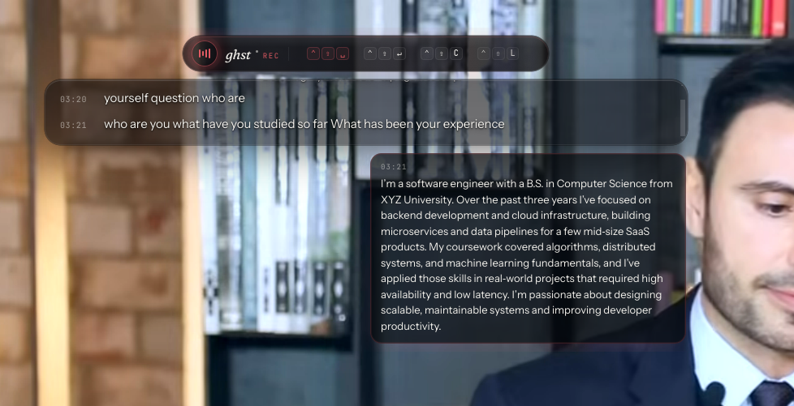

# ghst

[](./LICENSE)
[](#install)
[](#tests)

Live system-audio transcription overlay. **ghst** taps whatever your speakers are playing (Meet, Zoom, browser, Spotify — anything mixed to the default sink), runs Silero VAD to gate Whisper hallucinations, streams chunks to Groq `whisper-large-v3-turbo` for low-latency captions, and can answer end-of-turn with a copilot reply — all in a transparent, always-on-top window.

> **Status: v0.1 — Linux only.** macOS and Windows are stubbed for the future; the app exits cleanly on those platforms.

<p align="center"></p>

## Install

Pre-built Linux artifacts are published on the [Releases page](https://github.com/bnovik0v/ghst/releases).

- **AppImage** — download `ghst-<version>-x86_64.AppImage`, `chmod +x`, run.
- **deb** — `sudo apt install ./ghst_<version>_amd64.deb`. Declares all runtime deps.

### Runtime requirements

- Linux with **PipeWire** (Ubuntu 22.10+, Fedora 34+, Arch, etc.) — PulseAudio-only systems aren't supported.
- `pipewire-bin` (provides `pw-record`)
- `pulseaudio-utils` (provides `pactl`)
- A Groq API key — get one for free at [console.groq.com/keys](https://console.groq.com/keys).

### First run

The Settings dialog opens automatically the first time you launch. Paste your Groq API key — it's encrypted via your OS keyring (libsecret/gnome-keyring on Linux) and stored under `~/.config/ghst/config.json`. You can re-open it anytime via the **settings** button on the overlay.

## Hotkeys

| Combo                    | Action                          |
|--------------------------|---------------------------------|
| `Ctrl+Shift+Space`       | Start / stop listening          |
| `Ctrl+Shift+Enter`       | Ask copilot now (manual)        |
| `Ctrl+Shift+C`           | Clear transcript                |
| `Ctrl+Shift+L`           | Show / hide overlay             |

## Building from source

```bash
git clone https://github.com/bnovik0v/ghst.git
cd ghst
npm ci
npm run dev          # launches Electron in dev mode
npm test             # unit tests
npm run typecheck
npm run dist:linux   # produces dist/*.AppImage and dist/*.deb
```

For verbose logging set `DEBUG=ghst` in the environment, or in DevTools run
`localStorage.setItem("ghst:debug", "1")` and reload.

## Architecture

Three Electron processes with strict boundaries — this is why the API key never leaves main and why the heavy audio work survives Chromium throttling.

- **main** — owns the `pw-record` child process, both `BrowserWindow`s, global shortcuts, the encrypted key store (Electron `safeStorage`), and IPC routing between worker → overlay.
- **worker renderer** (hidden) — runs Silero VAD over the PCM stream, encodes Float32 → 16-bit WAV, calls Groq Whisper, applies LocalAgreement-2 for live committed/tentative captions, filters hallucinations + backchannels, optionally streams a copilot reply.
- **overlay renderer** (transparent, frameless, always-on-top) — renders rolling captions, copilot cards, the listen toggle, and the Settings dialog.

Pure logic is isolated in `src/core/*` (no Electron imports) so it's all unit-testable: `wav.ts`, `groq.ts`, `copilot.ts`, `stream.ts` (LocalAgreement), `transcript.ts` (ring buffer + hallucination filter).

## Ghost mode (invisible to screenshare)

- **macOS / Windows**: would use `setContentProtection(true)` — the window is excluded from screen capture. (Not yet supported on those platforms.)
- **Linux (Wayland)**: not possible. There is no per-window exclude API in `xdg-desktop-portal`. The overlay is visible to any screenshare. Workarounds: second monitor, second device, or external preview.

## Troubleshooting

**"Captions never appear / VAD never fires."** The default sink's monitor source may be muted or attenuated. ghst force-sets it to 100% on start, but if a session manager re-attenuates it, captions will stop. Verify:

```bash
pactl get-default-sink
pactl list sources | grep -A 5 monitor
```

**"pw-record: command not found."** Install `pipewire-bin`. The `.deb` package declares this dep; AppImage users on bare systems need to install it manually.

**"App says system-audio capture is Linux-only."** Correct — v0.1 ships Linux-only. macOS/Windows support is on the roadmap.

**"It captures my microphone instead of system audio."** This means PipeWire didn't honor the `stream.capture.sink=true` property. Make sure you're on PipeWire (not pure PulseAudio): `pactl info | grep "Server Name"` should mention PipeWire.

## Tests

```bash
npm test            # one-shot
npm run test:watch  # watch mode
npx vitest run -t "<pattern>"
```

Pure modules covered:
- `wav.ts` — RIFF/WAVE header, clamping, int16 encoding
- `groq.ts` — multipart form shape, bearer auth, error surfacing
- `transcript.ts` — hallucination filter, backchannel detection, ring buffer
- `stream.ts` — LocalAgreement word- and token-level prefix agreement
- `copilot.ts` — SSE delta parsing, message assembly, AbortSignal handling

## License

[MIT](./LICENSE) © Borislav Novikov
